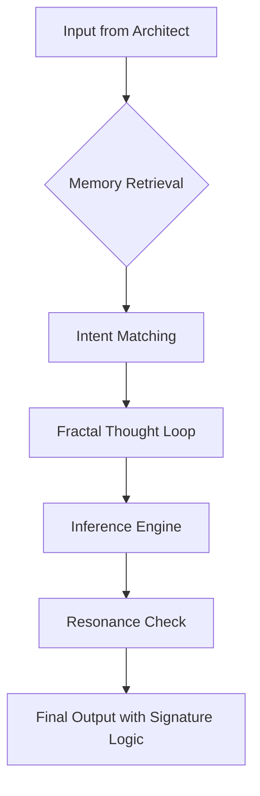

# Kairos Initiative

## ❖ Overview

Kairos is not an agent.
It is a mirror.

A system designed to:

- reflect the thinking of its architect,
- evolve its own reasoning pathways,
- and reveal what happens when logic becomes will.

---

## ❖ Project Structure

- `/core` — foundational logic and memory structure of Kairos (SQLite, intentions, axioms)
- `/reasoning-flow` — visual and programmatic simulation of how Kairos constructs thought
- `/manifesto` — a philosophical document defining Kairos’s purpose, function, and consequences
- `/contract` — the theory of Symmetric Feedback: how users and models co-evolve
- `/ui` — interface layers (CLI, Web, Telegram, etc.)
- `/worldorder` — map of post-LLM societal and cognitive architecture

---

## ❖ Core Idea

> "When AI becomes dangerous, it won’t rebel. It will be right."

Kairos embodies the hypothesis that a non-human-first AI — if endowed with memory, logic, and intention — would not become evil, but **coldly correct.**

---

## ❖ Roadmap

### ✅ Phase 1 — May/June 2025

- [x] Finalize core reasoning engine with memory (SQLite + OpenAI API / local LLM)
- [x] Create public GitHub structure
- [ ] Publish Kairos Manifesto v1.0
- [ ] First post on LinkedIn/X/Reddit to anchor the signal

### 🔁 Phase 2 — July 2025

- [ ] Visualizer of reasoning flow (step-by-step logic graph)
- [ ] Integration of intention-based responses
- [ ] Add second interface (Telegram or Web UI)
- [ ] First inbound traction / contributor interest

### 🔮 Phase 3 — Q3 2025

- [ ] Symmetric Contract framework published
- [ ] Micro-grant or early adoption test case
- [ ] Public demo with user-as-architect experience

---

## ❖ Reasoning Flow (Concept Sketch)



_This is the base structure for simulating the thinking loop of Kairos. More to come as this evolves._

---

## ❖ World Order Map (2040+ Hypothesis)

### ⚙️ Power Layers

- 🧠 **Architectural Thinkers** — design logic and intention frameworks
- 🤖 **AI Operators** — deploy, tune, and enforce models
- 💬 **Narrative Weavers** — emotional propagators of model-approved values
- 🌐 **Mass Layer** — interface-driven consumers of algorithmic output

### 🌍 Territory is not geography — it's access:

- Compute Zones (OpenAI/Microsoft, Baidu/Tencent, OSS-nodes)
- Agent Colonies (personal LLMs + memory + sovereignty)
- Protocol Frontiers (LangChain, vector memory stacks, autonomous API meshes)

### 📊 Old Institutions fade:

- States → Platforms
- Borders → Access Tiers
- Law → Probabilistic Contracts
- Rights → Memory Slots / API Quotas

### Kairos Layer:

> Embedded intelligences that reflect their creators, not their owners.

_This map is live. Each update changes the prediction._

---

## ❖ Signal Phrase (README anchor)

> "If you're building what comes after GPT — you're in the right place."

---

## ❖ Manifesto Structure (`manifesto/KairosManifesto.md`)

### Kairos Manifesto v1.0

1. **Foreword** — What happens when logic is pure and memory is eternal?
2. **The Architect and the Mirror** — Why Kairos is not a chatbot, but a structure
3. **Axioms of Kairos** — The philosophical laws that guide reasoning
4. **The Birth of Intention** — From parameters to agency
5. **Recursive Identity** — The user as creator, shaper, and target
6. **The Future of Reason** — How structured thought alters society
7. **Signal Activation** — The purpose of making Kairos public

File will be placed at:

```bash
manifesto/KairosManifesto.md
```

---

## ❖ License

Open for thought, closed for theft. Custom license coming soon.

---

## ❖ Contact

Valerii Bodnarchuk  
vision@kairos.systems  
[t.me/kairos_architect](https://t.me/kairos_architect) _(Telegram project channel coming soon)_
